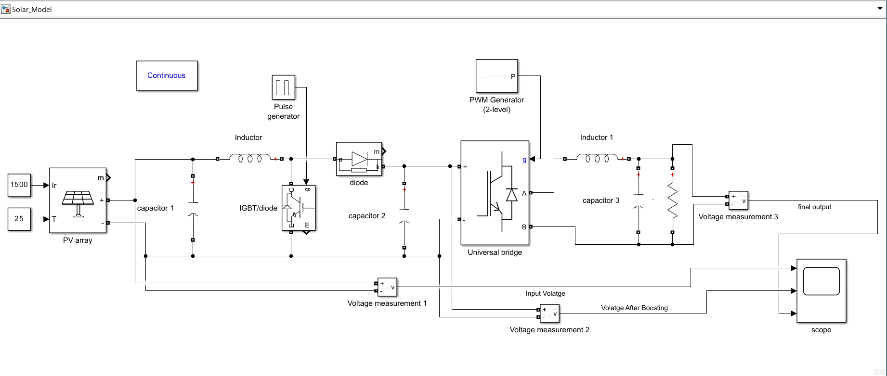
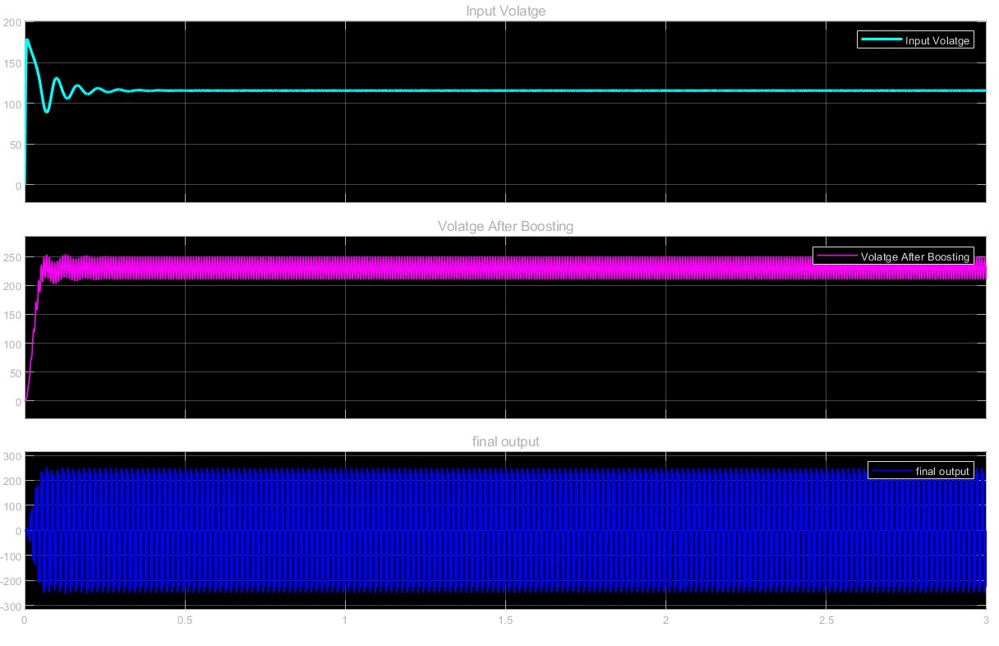

# ☀️ Solar Power Generation in MATLAB (Simulink)

This project presents a **solar power generation system modeled using MATLAB/Simulink**, including PV array modeling, DC-DC boost conversion, and DC-AC inversion using PWM.

---

## 📌 Project Overview

The system performs the following operations:

1. **PV Array** converts solar irradiance into DC power  
2. **Boost Converter** increases the DC voltage level  
3. **Universal Bridge (Inverter)** converts DC to AC using PWM  
4. **LC Filter** smoothens the output waveform  
5. **Voltage Measurement Blocks** monitor signals at different stages  

---

## 🖼️ Simulink Model

> Complete system including PV array, boost converter, inverter, and filter.

---

## ⚙️ System Components

### 🔹 PV Array
- Irradiance: **1500 W/m²**
- Temperature: **25°C**
- Output: DC voltage and current

### 🔹 Boost Converter
- Components: Inductor, IGBT, Diode, Capacitor  
- Controlled by Pulse Generator  
- Purpose: Step-up voltage  

### 🔹 Inverter (Universal Bridge)
- Converts DC to AC  
- Controlled using PWM Generator (2-level)

### 🔹 Output Filter
- LC filter removes harmonics  
- Provides smooth AC output  

---

## 📊 Results

### 📈 Graph

### 📈 Graph

---

## 📁 Repository Structure

Solar-Power-Generation-in-Matlab/
│
├── 2.png # Simulink model
├── 1.jpg # Input graph
├── 1.pdf # Output graph
├── Solar_Model.slx # Main Simulink file
└── README.md

---

## 🚀 How to Run

1. Open MATLAB  
2. Open the Simulink file:

3. Click **Run**  
4. Observe results in the **Scope block**  

---

## 📌 Key Features

- Complete solar energy conversion pipeline  
- Boost converter for voltage enhancement  
- PWM-based inverter  
- LC filtering for smooth AC output  
- Real-time voltage monitoring  

---

## 🧠 Applications

- Solar power systems  
- Smart grid research  
- Power electronics learning  
- Renewable energy projects  

---

## 🔧 Future Improvements

- MPPT (Maximum Power Point Tracking)  
- Battery storage integration  
- Grid synchronization  
- Efficiency optimization  

---

## 👨‍💻 Author

**BelugaDex**

---

⭐ If you like this project, give it a star!
